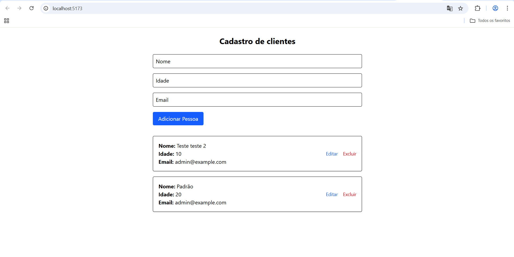

#  CRUD de Clientes

Este projeto é um sistema completo de **CRUD (Create, Read, Update, Delete)** de clientes, com **frontend em React 19** e **backend em Node.js com Express**, ambos utilizando **TypeScript**.

---

<!-- Exibindo a imagem de tela -->
<h3>Tela de Listagem de Clientes:</h3>


---

##  Tecnologias Utilizadas

###  Backend (Node.js + Express + TypeScript)

- **Node.js** – Ambiente de execução JavaScript
- **Express** – Framework web para construção de APIs
- **TypeScript** – Tipagem estática para maior segurança
- **ts-node-dev** – Hot reload durante o desenvolvimento
- **@types/node** e **@types/express** – Tipagens para uso com TypeScript

###  Frontend (React + Tailwind + Vite)

- **React 19** – Biblioteca para construção de interfaces
- **Vite** – Bundler moderno e rápido para desenvolvimento
- **Tailwind CSS** – Framework de CSS utilitário para estilização
- **TypeScript** – Tipagem estática também no frontend
- **ESLint** – Linter para manter a qualidade do código
- **@vitejs/plugin-react** – Integração React com Vite

---

##  Funcionalidades

-  Cadastro de clientes
-  Listagem de todos os clientes
-  Edição de dados dos clientes
-  Remoção de clientes
-  Interface responsiva e moderna com Tailwind CSS
-  API RESTful com rotas separadas para cada operação

---

##  Como Rodar o Projeto

### 1. Clone o repositório

```bash
git clone https://github.com/Jadilson-Silva/crud-clientes.git
cd crud-clientes
npm install para instalar as dependencias
npm rum dev pra executar o projeto